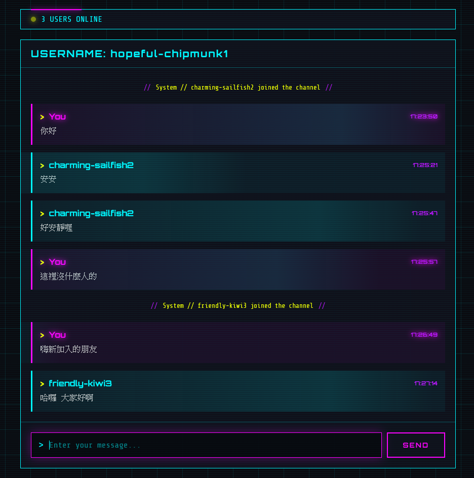

# chatroom
A simple golang project to practice using websocket

**Frontend**
index.html: HTML + CSS AI coding, Script Human craft

**Backend** -- All human craft

client.go: read/write message to client

hub.go: manage client and broadcast message

randname.go: generate random user name

main.go: simple http server



## How to use?
```
go build -o main
./main
```

## How to change port and ip?
Modify main.go, assets/index.html port and ip setting inside these two file.